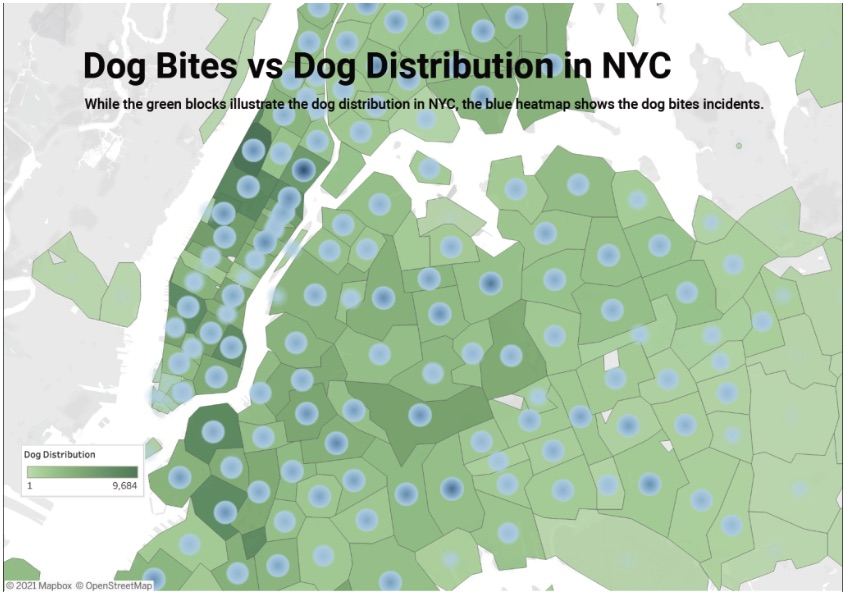

| [home page](README.md) | [data viz examples](dataviz-examples.md) |[visualizing government debt](visualizing-government-debt.md) | [critique by design](critique-by-design.md) | [final project I](final-project-part-one.md) | [final project II](final-project-part-two.md) | [final project III](final-project-part-three.md) |

# Reinvisioning Dog Bite Data

## Step one: the visualization
For this critique, I'm utilizing the viz "Dog Bites vs Dog Distribution in NYC". My 9 yo keeps hounding me (no pun intended) about getting a new dog. While we're not in New York City, I thought this would be helpful to dive into. I find myself using a lot of maps in my work, and sometimes question if maps are the best way to go. With those two ideas in mind, one personal and one professional, I thought this would be a useful starting point.

This viz was made accessible through MakeoverMonday.co.uk, and the original source is https://studentwork.prattsi.org/infovis/visualization/dog-breeds-data-visualization/, accessed November 7, 2025.

## Step two: the critique
For ease, I'm breaking down the components of Stephen Few's Data Visualization Effectiveness Profile:
- Usefulness: I was able to think of a few audiences for this visualization. If you were in real estate, looking to buy a house, or even in public health, this visualization would be helpful to you. It communicates need for animal safety, as well as areas that are less populated if dogs aren't your thing.
- Completeness: I felt like it was lacking in this area. The legend only spoke to the green areas, but didn't fully articulate the shading. The dog distribution would have been better articulated with steps instead of a gradient scale. The legend also failed to acknowledge the heatmap. While the subheading referenced it, it's location overlayed on the map made the notation easy to overlook.
- Perceptibility: I think there is effort required to understand this visualization. It is looking at dog distribution, zip code, and the frequency of bites. Three variables feels like a lot on a map. The creator was trying to show that higher populations results in a graeter number of bites, but this does not always prove that. The location of the map within the frame also draws the eye to the larger boroughs, leading you to believe that's where the most bites occur. The most bites are in a different portion of the map, but overlooked due to it's location.
- Truthfulness: The data sourced is inaccurate and at times, not clearly defined. There are numerous zip codes listed that are not actually in NYC, despite those locations not being a focus of the map. There are also zip codes that are white, which does not appear to be on the scale. 
- Intuitiveness: The incomplete legend makes this graphic hard to interpret. There is an attempt to right this wrong due to the use of subheading, but that sort of information should not lie in the subheading, making it a confusing spot.
- Aesthetics: Aestetically, this is middle of the road. I am not opposed to the colors or shading for intensity, but I think the use of the colors and heatmap is too much to interpret at every zip code.
- Engagement: I did not learn any additional information by viewing this. I may even have a few more questions than I did before. 

Overall thoughts: Visually, I'm neutral, but in terms of presenting data, I think there are areas for improvement. As an outsider, I would want the map to focus on boroughs, because that has relevance to me, rather than zip codes. I also think the question can't necessarily be addressed with this information as is. An important question for the audience, especially people looking to move, is "Are the dog bite incidents caused by dogs who live here?". This would help us really understand if the area is safe for dog owners and their pets or if incidents occur when owners travel outside of their zip code to places like public parks.

## Step three: Sketch a solution
I made two quick vizs in Tableau Public. But before drafting, I filtered the data to only includ 2021. I felt like the years pre-pandemic would tell a different story than post-pandemic. 

In the first viz, I focused on the top ten dog breeds reported as biters in 2021. A quick histogram was able to do the trick.

In the original, it felt like they were also trying to focus on location of incidents. Here a red treemap communicated this information. I used the red scale because it communicated urgency. I excluded "other" from the viz as it represented bites outside of the five NYC boroughs.

## Step four: Test the solution

_Before you conduct your interviews, prepare a simple script.  Use this as a guide and as a way to take notes as you go forward. Come up with your own list of questions you want to ask for the selected visualization. Keep the questions broad so you can get the most value out of your feedback. Then, document answers to your questions here._

Questions to ask (modify these for your own interviews): 

- Can you tell me what you think this is?

- Can you describe to me what this is telling you?

- Is there anything you find surprising or confusing?

- Who do you think is the intended audience for this?

- Is there anything you would change or do differently?

Results: 

_Don't identify or share personally identifiable information (PII) about the people you spoke to._

| Question | Interview 1 | Interview 2 |
|----------|-------------|-------------|
|          |             |             |
|          |             |             |
|          |             |             |

Synthesis: 

_What patterns in the feedback emerge?  What did you learn from the feedback?  Based on this feedback, come up with what design changes you think might make the most sense in your final redesign._

## Step five: build the solution

_Include and describe your final solution here. It's also a good idea to summarize your thoughts on the process overall. When you're done with the assignment, this page should all the items mentioned in the assignment page on Canvas(a link or screenshot of the original data visualization, documentation explaining your process, a summary of your wireframes and user feedback, your final, redesigned data visualization, etc.)._

## References
_List any references you used here._

## AI acknowledgements
_If you used AI to help you complete this assignment (within the parameters of the instruction and course guidelines), detail your use of AI for this assignment here._

