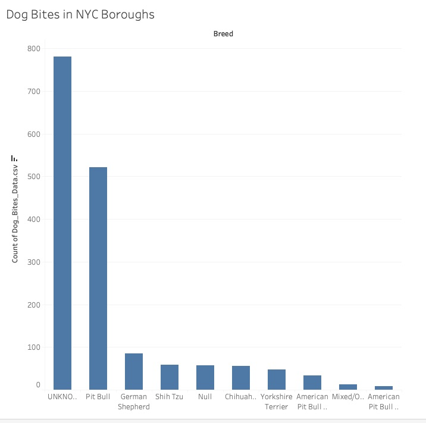
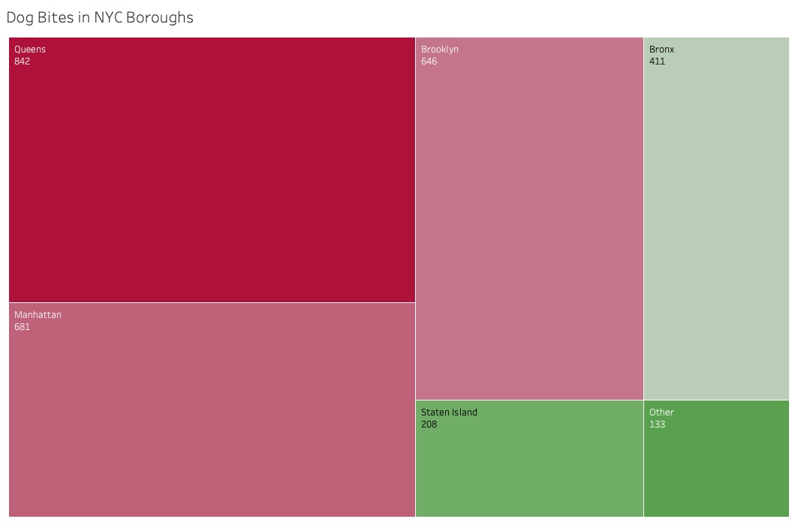

| [home page](README.md) | [data viz examples](dataviz-examples.md) |[visualizing government debt](visualizing-government-debt.md) | [critique by design](critique-by-design.md) | [final project I](final-project-part-one.md) | [final project II](final-project-part-two.md) | [final project III](final-project-part-three.md) |

# Reinvisioning Dog Bite Data

## Step one: the visualization
For this critique, I'm utilizing the viz "Dog Bites vs Dog Distribution in NYC". My 9 yo keeps hounding me (no pun intended) about getting a new dog. While we're not in New York City, I thought this would be helpful to dive into. I find myself using a lot of maps in my work, and sometimes question if maps are the best way to go. With those two ideas in mind, one personal and one professional, I thought this would be a useful starting point.

This viz was made accessible through MakeoverMonday.co.uk, and the original source is https://studentwork.prattsi.org/infovis/visualization/dog-breeds-data-visualization/, accessed November 7, 2025.

## Step two: The critique
For ease, I'm breaking down the components of Stephen Few's Data Visualization Effectiveness Profile:
- Usefulness: I was able to think of a few audiences for this visualization. If you were in real estate, looking to buy a house, or even in public health, this visualization would be helpful to you. It communicates need for animal safety, as well as areas that are less populated if dogs aren't your thing.
- Completeness: I felt like it was lacking in this area. The legend only spoke to the green areas, but didn't fully articulate the shading. The dog distribution would have been better articulated with steps instead of a gradient scale. The legend also failed to acknowledge the heatmap. While the subheading referenced it, it's location overlayed on the map made the notation easy to overlook.
- Perceptibility: I think there is effort required to understand this visualization. It is looking at dog distribution, zip code, and the frequency of bites. Three variables feels like a lot on a map. The creator was trying to show that higher populations results in a graeter number of bites, but this does not always prove that. The location of the map within the frame also draws the eye to the larger boroughs, leading you to believe that's where the most bites occur. The most bites are in a different portion of the map, but overlooked due to it's location.
- Truthfulness: The data sourced is inaccurate and at times, not clearly defined. There are numerous zip codes listed that are not actually in NYC, despite those locations not being a focus of the map. There are also zip codes that are white, which does not appear to be on the scale. 
- Intuitiveness: The incomplete legend makes this graphic hard to interpret. There is an attempt to right this wrong due to the use of subheading, but that sort of information should not lie in the subheading, making it a confusing spot.
- Aesthetics: Aestetically, this is middle of the road. I am not opposed to the colors or shading for intensity, but I think the use of the colors and heatmap is too much to interpret at every zip code.
- Engagement: I did not learn any additional information by viewing this. I may even have a few more questions than I did before. 

Overall thoughts: Visually, I'm neutral, but in terms of presenting data, I think there are areas for improvement. As an outsider, I would want the map to focus on boroughs, because that has relevance to me, rather than zip codes. I also think the question can't necessarily be addressed with this information as is. An important question for the audience, especially people looking to move, is "Are the dog bite incidents caused by dogs who live here?". This would help us really understand if the area is safe for dog owners and their pets or if incidents occur when owners travel outside of their zip code to places like public parks.

## Step three: Sketch a solution
I made two quick vizs in Tableau Public. But before drafting, I filtered the data to only includ 2021. I felt like the years pre-pandemic would tell a different story than post-pandemic. 

In the first viz, I focused on the top ten dog breeds reported as biters in 2021. A quick histogram was able to do the trick.

In the original, it felt like they were also trying to focus on location of incidents. Here a red treemap communicated this information. I used the red scale because it communicated urgency. I excluded "other" from the viz as it represented bites outside of the five NYC boroughs.

## Step four: Test the solution
My group included two BIDA students and one Healthcare Analytics student. All of the feedback came from international students, which provided feedback that I might not have otherwise received.

Common themes focused on:
- Labels: What years are represented? How can you rotate labels to make text more clear to the audience?
- Definitions: What does "borough" mean and why do you keep going back to that word? Does "unknown" matter, if so, what does it mean?
- Display: Are there places to add colors? Why did you choose that color scale for the heatmap? Is red the most intense? Could you add text to the heat map squares to highlight breeds of importance? Should this information live on a map instead?

Sitting down with my group was so helpful. It reminded me that I needed up update my visualizations rather than lean into the narratives for explanations. Based on this feedback, I'm going to focus my solution on:
- adding clarity to my labels
- enhancing the treemap
- possibly creating a dashboard that allows me to continue to utilize a map without overcrowding a map with too many datasources.

## Step five: build the solution

<noscript></noscript><object class='tableauViz'  style='display:none;'><param name='host_url' value='https%3A%2F%2Fpublic.tableau.com%2F' /> <param name='embed_code_version' value='3' /> <param name='site_root' value='' /><param name='name' value='critiquebydesign&#47;Dashboard1' /><param name='tabs' value='no' /><param name='toolbar' value='yes' /><param name='static_image' value='https:&#47;&#47;public.tableau.com&#47;static&#47;images&#47;cr&#47;critiquebydesign&#47;Dashboard1&#47;1.png' /> <param name='animate_transition' value='yes' /><param name='display_static_image' value='yes' /><param name='display_spinner' value='yes' /><param name='display_overlay' value='yes' /><param name='display_count' value='yes' /><param name='language' value='en-US' /></object>

I decided to take the feedback and make a dashboard because of limitations with my knowledge with Tableau. The goal of the dashboard was to highlight neighborhoods and reported incidences and map them in a way that the general public would understand. As a non-New Yorker, saying Queens means nothing to me, but by using the treemap as a filter, I'm able to see where exactly that is referring to. In addition, I added a 2018 census map that was included in Tableau. This would give the viewer the opportunity to further understand the neighborhood. Are dog bites high because population is high? Or are dog bites disproportionately higher in a particular borough over others? Paired with the census data, those inferences could be made.

I was looking at this from the lens of a buyer or renter where boroughs and zip codes likely matter. Additional filters were added to the side so the audience can target a particular area that might be of interest, whether it's their potential new home, running route, or child's extra-curriculars.

There are many places I'd like to go with this visualization but had limitations due to my abilities and the dataset. I wanted to include information about the dog breeds, as seen in my initial graphs, but once the graphs were linked and filtered, found that information was not as helpful. 

If I were to continue to work on these visualizations, I would spend time focusing on definitions. The first is the use of "other" as a Borough. It is unclear on the dataset why other is used. In addition, there is little to support if the incident occured in that borough regardless of where the dog was registered, or if the dog was registered in that borough and the incident occurred elsewhere. This would be an important consideration for data collection as it would ultimately impact the information presented in the graph. Another poorly defined area was breed type. The dataset itself included 1,621 different breed types. Excluding it was the right call for the purpose of the real estate audience. If I wanted to change the audience to animal rescues, vets, or foster families, I'd explore ways to consolidate that data as the set as is includes too many variables for the audience.

## References
"Dog Bites vs Dog Distribution in NYC." https://studentwork.prattsi.org/infovis/visualization/dog-breeds-data-visualization/, accessed November 7, 2025.
"2023/W22: Dog Bites in New York." data.world/makeovermonday/2023w22, accessed November 7, 2025.

## AI acknowledgements
I consulted ChatGPT to help transfer my code and images to GitHub. Through TA office hours and a little bit of grit, I was able to figure it out in a more effective way than what ChatGPT acknowledged.

