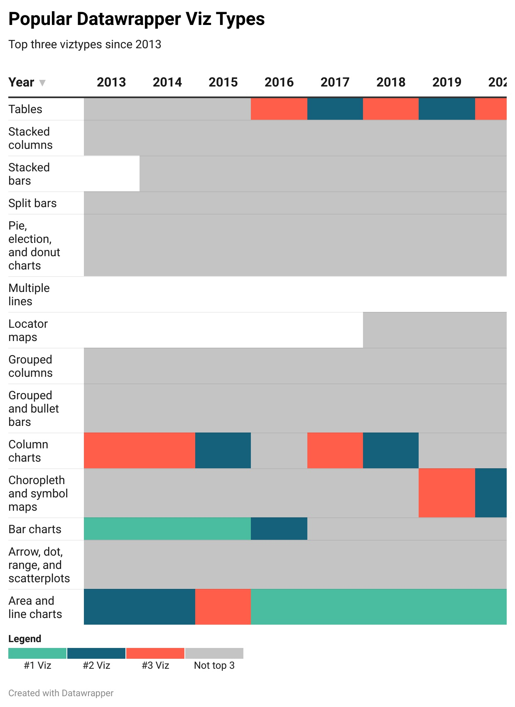

| [home page](README.md) | [data viz examples](dataviz-examples.md) |[visualizing government debt](visualizing-government-debt.md) | [critique by design](critique-by-design.md) | [final project I](final-project-part-one.md) | [final project II](final-project-part-two.md) | [final project III](final-project-part-three.md) |

# Data visualization examples
Here are some examples of in-class exercises.

*I know this one needs some work. The original version continues to 2023.*
