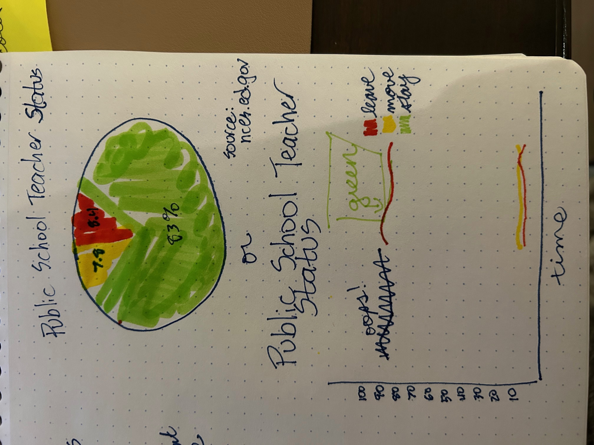
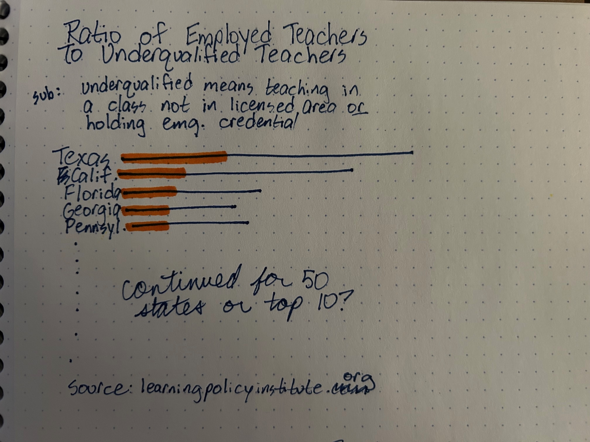
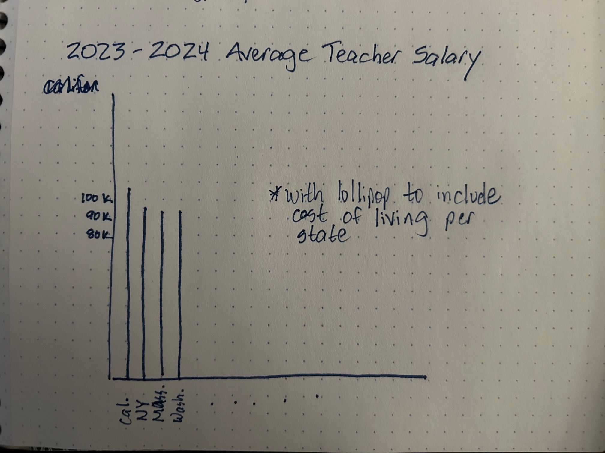

| [home page](README.md) | [data viz examples](dataviz-examples.md) |[visualizing government debt](visualizing-government-debt.md) | [critique by design](critique-by-design.md) | [final project I](final-project-part-one.md) | [final project II](final-project-part-two.md) | [final project III](final-project-part-three.md) | [teacher story](teacher-story-examples.md)|

# Outline

Aspiring teachers, like many college graduates, face big questions about their future: What content area inspires me? Is there an age group that’s a good fit? Where do I want to live and work? What type of impact do I want to make? 

The profession is experiencing rapid change, and where a teacher chooses to work can shape their day-to-day work and long term trajectory in the field. As new educators sign contracts and move into their first classrooms, how much do they really know about what lies ahead, including job availability, salary trends, and the likelihood that they’ll continue to teacher in their certified area or stay in the field?

This story is designed to look into K-12 public school teacher employment, their salaries, and other variables teachers need to know to think beyond their first year and into a sustainable career.

As a former classroom teacher, I created this story to help aspiring teachers make the first step in their career as they begin, or narrow down, their job search with confidence and understanding. Below is my vision for the story. Join me as I walk through the accompanying visualizations and story.

 
# Project Structure

The story will kick off with the number of employed teachers by state, which is exciting to see, giving the feeling of options. This is important for new teachers seeking community or options. A state with a large number of teachers tells us that there are more schools. More schools means they can find an administrative or curricular fit, as well as a school that is in close proximity to home if a short commute is priority. As of now, I intend to use a gradient scale map that is far more to scale and precise than the current map.

Despite the number of teachers that exist, things happen and people choose to stay in the field, move to new schools, or leave the profession all together. But why? Beyond personal factors such as staying at home or relocating, why are teachers moving or leaving? At this point, I am unsure if I want to make this a longitudnal overview or focus on the data from 2021-2022 in a pie graph. I'm leaning towards the pie graph because of how slight the shifts are in the line graph, but will see if adapting the scale has an impact.

The challenges teachers face continue as while a teacher may be employed, they may be underqualified. In these situations, teachers are placed, often to no decision of their own, in a classroom that they are not certified to teach or, pending state, they may hold an emergency license. Emergency licenses are most common in states that are in crisis for particular subsets, which unfortunately, is often to the detriment of the most vulnerable learners such as pre-kindergarten or special education students. This will make aspiring teachers pause as they consider the importance of permanency and preparedness. At the time of submission, I'm insure if this will include all 50 states or include a map and filter to highlight particular states.

The next portion of the story starts to paint a bleak picture, and that’s when salary moves into the equation. Here the story will highlight the variability of salary across states, and hopefully include median household income as a comparison. This will help the audience understand that a high salary is not always adequate for the cost of living. Changes in this visualization will include cost of living data, either as a lollipop addition to the histogram or turning the histogram data into a map with census overlay.

The system is broken and students are suffering. Charged with the proper information, aspiring educators can make informed decisions on where to launch their careers and better understand their trajectory as well as the impact it will have on the state.

# The data

A variety of data sources were used to launch this project. Finding the appropriate sources was a bit of trial and error as I finetuned the story. Data included state level workforce information focused on teachers. Federal data will be layered into the state data (when appropriate) to provide a comparison for issues such as cost of living and how far a teacher salary can go. Census data will be referenced throughout the story, but will be pulled directly through Tableau dashboard rather than a public dataset.

It is important to note that there were state exclusions in many sets. Pending the data set, they tend to fall into one of two reasons. The first reason for exclusion is that the state did not provide data. Some of the information was acquired on a voluntary basis and the state, for whatever reason, chose not to report the data. Another reason for exclusion is that the sample set was too small for accurate reporting. 

An overview of the sources and their purpose is outlined in the table below:

| Name | URL | Description |
|------|-----|-------------|
|   Cost of living by state in USA   |   [https://tinyurl.com/yc6rz8zc](https://tinyurl.com/yc6rz8zc)  |      The COL by state will layer into salary to help the audience understand whether or not average teacher salary is proportionate to the regions cost of living.   |
| Teacher Shortage Data | [https://tinyurl.com/mspkm6um](https://tinyurl.com/mspkm6um) | Teacher shortage data provides an overview of the intricacies of teacher shortage, including vacancies and underqualifications, and relates the shortages to student population. |
|   Teacher Status by characteristics  | [https://tinyurl.com/4cxdx3nz](https://tinyurl.com/4cxdx3nz)  |    This dataset provides percentages by state of teachers who stay, move schools, or leave the profession. Originally a part of a larger pdf, one table was converted into excel for the purpose of this dataset. |
| Teacher Status by Year | [https://tinyurl.com/4bj2zb73](https://tinyurl.com/4bj2zb73) | This dataset focuses on the national trend of teachers who stay, move, or leave. Like the by state dataset, it was once part of a larger pdf, trimmed for the purpose of this story.
|  Ed Degrees Conferred  |  [https://tinyurl.com/mus7r38v](https://tinyurl.com/mus7r38v) |   This dataset provides a longitudinal overview of the number of bachelor degrees conferred across 33 fields of study.          |
| Teacher Shortage by Credentials | [https://tinyurl.com/5avwdvr2](https://tinyurl.com/5avwdvr2) | The National Conference of State Legislatures provides a detailed overview of teacher shortages by credentialed subjects. The data was filtered to only include the 2022-2023 academic year shortages, which aligns with other data in the story.

# Method and medium
Phase 1 sketches were rough, using marker and dot grid notepaper. I’m hoping to bring my ideas to life in phases 2 and 3 using tableau and datawrapper. The final project will be my first attempt at using shorthand. Stay tuned!

## References
Learning Policy Institute. _State Teacher Shortages: Vacancy and Resource Tool._ 2024. Accessed 14 Nov. 2025. https://learningpolicyinstitute.org/product/state-teacher-shortages-vacancy-resource-tool-2024, 
Lukkardata. _Cost of living by state in USA - Missouri Economic Research_. accessed 16 Nov. 2025. https://www.kaggle.com/datasets/lukkardata/cost-of-living-missouri-economic-research

National Center for Education Statistics. _Digest of Education Statistics._ U.S. Department of Education. accessed 14 Nov. 2025. https://nces.ed.gov/programs/digest

National Center for Education Statistics. _Teacher Attrition and Mobility Results from the 2021-2022 Teacher Follow-up Survey to the National Teacher and Principal Survey_. U.S. Department of Education, 2024. Accessed 16 Nov. 2025. https://nces.ed.gov

National Education Association. _Rankings of the States 2024 and Estimates of School Statistics 2025._ NEA Research. Accessed 14 Nov. 2025. https://www.nea.org/sites/default/files/2025-04/2025_rankings_and_estimates_report.pdf.

U.S. Department of Education. _Teacher Shortage Areas (TSA) Reports._ Accessed 16 Nov. 2025. https://tsa.ed.gov/#/reports

## AI acknowledgements
Copilot was utilized during phase 1 of this assignment to support the search of datasets. Copilot helped me refine my language to get the appropriate results. For example, I was interested in career trajectories, and Copilot helped me understand that the language I was using was not inclusive of all states and encouraged me to refine my question to include “stayers, movers, and leavers” (National Center for Educational Statistics) for concise information.

